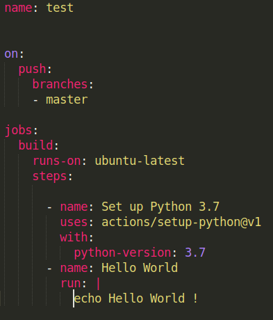

# GitHub Action Tutorial #1

## What is a GitHub Action?

### The Long Story
[here](https://help.github.com/en/actions/automating-your-workflow-with-github-actions)

### TL;DR
GitHub Action is a toolkit that aids in the customization of a software development life cycle. In some cases, it will be rather simple to think of GitHub Action as a continuous integration/continuous delivery(deployment) (CI/CD) service equivalent hosted by GitHub itself. A short example of GitHub Action would be automating email notifications whenever a merge/pull/whatever request is made.

## Jargons

### Runners

Runners are preferably Docker containers of which GitHub Actions run on. The context of this article would primarily be restricted to GitHub-hosted runners; however, please be aware that self-hosted runners are always an option and might come in handy when highly-customized workflow is needed.

### Events
Events are workflow triggers. Events can be tweaked granularly to listen to a specific activity, say, specified branch merges.

### Jobs
Each defined job will run on a separate GitHub-hosted runner. Jobs can run parallelly, sequentially, and/or even conditionally. 

### Steps 
Steps are building blocks of a job and run sequentially without any specifications. Steps that are defined in the same job share the same runner. They can be called to execute commands or use actions that have been created by one or another.

## A "Hello World" for GitHub Action (Explanations will come)

- Create a directory named ```.github/workflows/``` on the same level as your ```.git``` folder.
- Create a YAML[(Your Yaml Guide) ](https://www.codeproject.com/Articles/1214409/Learn-YAML-in-five-minutes) configuration file ```./github/workflows/{YOUR_WORKFLOW_NAME}.yml``` that resembles the following.

- 

- Push it along with your repository.
- GitHub would automatically scan all ```.yml``` and ```.yaml``` files contained within the previously mentioned directory and instantiate runners to hold the workflows configured by the YAML files.


